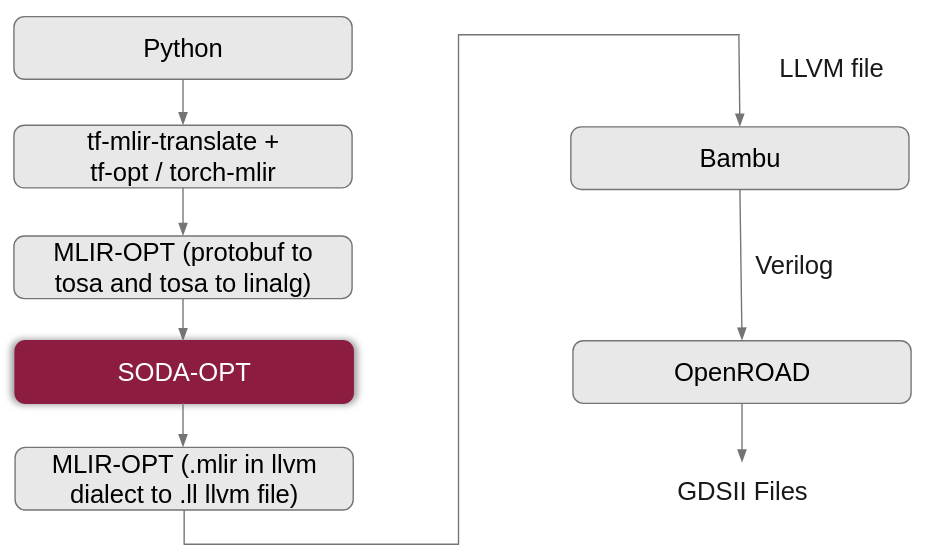

# Design Space Exploration for SODA (Software-Defined Accelerator) framework

**Abstract:**

SODA (Software-Defined Accelerator) is a framework that simplifies the generation of hardware accelerators from high-level languages such as Python, using the Multi-Level Intermediate Representation (MLIR) compiler framework. Neural network models utilizing Python libraries such as TensorFlow or PyTorch can be synthesized into chip designs through SODA framework.

This thesis explores loop and memory optimization techniques using the SODA framework to enhance computational efficiency in neural network hardware design. Loop transformations like permutation, tiling, and unrolling are applied to optimize performance, while memory access is improved through Temporary Buffer Allocation and Alloca Buffer Promotion. To handle larger neural networks within hardware limits, dimensional clipping is used, involving computation tiling and estimating the required number of tiles and clock cycles.

A Design Space Exploration (DSE) tool was developed to explore the above-mentioned optimizations on neural network layers such as 2D convolution, 2D depthwise convolution, and Fully Connected layers. By analyzing performance metrics, heuristics are derived that narrow the exploration space, reducing the time taken to reach optimal configurations.

Results demonstrate that hardware design for large neural networks can be significantly improved through advanced loop transformations within the SODA framework. This study enables the deployment of complex neural networks in hardware-constrained environments, contributing to more efficient hardware synthesis processes and providing valuable insights into affine-level loop optimization strategies.

## SODA Framework

### Python to ASIC flow



1. **Python**: Start with deep learning models in Python using frameworks like TensorFlow or PyTorch.
2. **Translate to MLIR**: Convert Python code to MLIR format using `tf-mlir-translate` and `tf-opt` for TensorFlow, or `torch-mlir` for PyTorch.
3. **MLIR Optimization**: Optimize MLIR by converting TensorFlow operations to TOSA (Tensor Operation Set Architecture) and Linalg dialect.
4. **SODA**: Partition host and accelerated code, apply loop and memory optimizations for ASIC generation.
5. **MLIR to LLVM**: Convert optimized MLIR to LLVM dialect, resulting in an LLVM intermediate file (.ll).
6. **Bambu HLS**: Use Bambu HLS to translate LLVM code to Verilog for hardware synthesis.
7. **OpenROAD**: Employ OpenROAD to generate a GDSII file from the Verilog, ready for ASIC manufacturing.

### GitHub

[PNNL SODA-OPT GitHub Repository](https://github.com/pnnl/soda-opt/)

### Docker

To pull Docker image, use the following command:

```bash
docker pull agostini01/soda
```

### Publications

- [ICCAD 2022](https://dl.acm.org/doi/abs/10.1145/3508352.3549424)
- [IEEE Micro 2022](https://ieeexplore.ieee.org/abstract/document/9786533)

```
@inproceedings{10.1145/3508352.3549424,
  author = {Bohm Agostini, Nicolas and Curzel, Serena and Amatya, Vinay and Tan, Cheng and Minutoli, Marco and Castellana, Vito Giovanni and Manzano, Joseph and Kaeli, David and Tumeo, Antonino},
  title = {An MLIR-Based Compiler Flow for System-Level Design and Hardware Acceleration},
  year = {2022},
  isbn = {9781450392174},
  publisher = {Association for Computing Machinery},
  address = {New York, NY, USA},
  doi = {10.1145/3508352.3549424},
  booktitle = {Proceedings of the 41st IEEE/ACM International Conference on Computer-Aided Design},
  articleno = {6},
  numpages = {9},
  keywords = {high-level optimizations, compilers, MLIR, HLS},
  location = {San Diego, California},
  series = {ICCAD '22}
}

@ARTICLE{9786533,
  author={Bohm Agostini, Nicolas and Curzel, Serena and Zhang, Jeff and Limaye, Ankur and Tan, Cheng and Amatya, Vinay and Minutoli, Marco and Castellana, Vito Giovanni and Manzano, Joseph and Brooks, David and Wei, Gu-Yeon and Tumeo, Antonino},
  journal={IEEE Micro}, 
  title={Bridging Python to Silicon: The SODA Toolchain}, 
  year={2022},
  doi={10.1109/MM.2022.3178580}}
```

## Design Space Exploration (DSE) Framework

### Project directory

```
📦 Project Root
├── 📁 images                      # Contains image files used in documentation or project output.
├── 📁 models                      # Holds machine learning or simulation models related to the project.
├── 📁 python_to_mlir              # Contains intermediate finals for Python to MLIR flow.
├── 📁 results                     # Stores results of Design Space Exploration in .csv format.
├── 📁 scripts                     # Contains scripts to run Bambu and OpenROAD.
├── 📁 src                         # Source code files for the main functionality of the project.
│   ├── conv2d_class.py            	# Class implementation for 2D Convolution layers.
│   ├── create_mlir_files.py       	# Script to generate MLIR files.
│   ├── depthwise_conv2d_class.py  	# Class implementation for Depthwise 2D Convolution layers.
│   ├── design_space_exploration.py 	# Handles design space exploration logic.
│   ├── fully_connected_class.py   	# Class implementation for fully connected layers.
│   ├── main.py                    	# Main script to execute the program.
│   ├── parse_arguments.py         	# Script for parsing command-line arguments.
│   ├── read_mlir.py               	# Reads and processes MLIR files.
│   └── utilities.py               	# Contains utility functions for various tasks.
├── .gitignore                     # Specifies files and directories to exclude from Git tracking.
├── README.md                      # Provides an overview and documentation for the project.
└── python_to_mlir.ipynb           # Jupyter Notebook for converting Python code to MLIR representation.

```

### DSE flow


1. **Input File**: Start with an MLIR file containing all neural network layers at the Linalg level. This file serves as the input for exploration.
2. **Argument Parsing**: Select the layer type (e.g., Conv2D, Depthwise Conv2D, FC) and loop optimizations (permutation, tiling, unrolling). Optionally, specify layers to start or end exploration. See options in the table below.
3. **Read MLIR File**: The tool reads and stores essential information about each layer and prepares them for further modifications.
4. **Create Temporary MLIR Files**: Temporary files with modified dimensions are created, marked with SODA syntax to designate the layer as accelerated, enabling ASIC generation.
5. **Design Space Exploration (DSE)**: Generate loop optimization combinations for each layer and run SODA, Bambu (HLS), and OpenRoad (synthesis and placement). Record metrics like power, performance, area, efficiency, and energy.
6. **Output File**: Save exploration results in a CSV file.

For additional resources and detailed explanations, please refer to the [docs](./docs) folder.

### a. Refined SODA Pipeline for Bambu


- **Affine Scalar Replacement before Unrolling**: Perform scalar replacement before loop unrolling to prevent a rapid increase in the number of scalar variables in the unrolled loop, which could lead to inefficiency and increased complexity.
- **Affine Data Copy Generation after Unrolling**: Run data copy optimization after unrolling to prevent unnecessary buffer expansion and to avoid generation large number of flip-flops at HLS stage.
- **Loop Optimization Order: Permutation, Tiling, then Unrolling**: Begin with permutation followed by tiling . Performing tiling as the first step significantly increases the number of possible permutations, leading to greater complexity and potentially inefficient exploration.

### b. HLS Configurations

| Configuration            | Values    | Remarks                                                                                         |
| ------------------------ | --------- | ----------------------------------------------------------------------------------------------- |
| Maximum clock cycles     | (2^32)-1  | Accommodates maximum allowable number of clock cycles by Bambu’s testbench.                    |
| Frequency                | 100 MHz   | No timing violations are observed at this frequency.                                            |
| Memory allocation policy | NO_BRAM   | Memory modules should not be synthesized. Memory modules are usually placed as macros in ASICs. |
| PDK                      | NanGate45 | NanGate45 is a commonly used open-source PDK for 45nm technology.                               |

### c. DSE Framework passes

| Type                        | Parameters             | Remarks                                              |
| --------------------------- | ---------------------- | ---------------------------------------------------- |
| **MLIR**              | `--read_mlir`        | Read Neural Network MLIR file (E.g. Resnet-18).      |
| **Loop optimization** | `--permute`          | Performs loop permutation.                           |
|                             | `--tile`             | Performs loop tiling.                                |
|                             | `--unroll`           | Performs loop unrolling.                             |
| **Type of NN layer**  | `--conv2d`           | (Optional) Explores 2D Convolution layers.           |
|                             | `--depthwise_conv2d` | (Optional) 2D Depth-wise Convolution layers.        |
|                             | `--matmul`           | (Optional) Explores Fully Connected layers.          |
| **Layer options**     | `--start_layer`      | (Optional) Select layer no. to start exploring from. |
|                             | `--end_layer`        | (Optional) Select layer no. to end exploring at.     |
|                             | `--select_layer`     | (Optional) Select a particular layer to explore.     |

### d. Commands to execute

This workflow guides you through converting a Python-based neural network model to MLIR format and running the DSE framework on it.

#### Pre-requisite

**1. Pull the Docker Image**: Use the following command to pull the Docker image for SODA framework:

```bash
docker pull agostini01/soda
```

**2. Install necessary packages for Python**: Use the following command to install all the python libraries required for DSE framework, using the file [requirements.txt](./requirements.txt):

```
pip install -r requirements.txt
```

#### Step 1: Convert Python Model to MLIR

1. **Open [python_to_mlir.ipynb](./python_to_mlir.ipynb)**: This notebook provides examples of neural network architectures and demonstrates how to translate them to the MLIR format.
2. **Run the Notebook Cells**: Execute each cell in the notebook to convert your Python-based neural network model (e.g., a model defined in TensorFlow or PyTorch) to MLIR.
3. **Save the MLIR File**: After running the notebook, the output MLIR file will be saved as [linalg-buffers.mlir](./python_to_mlir/linalg-buffers.mlir) in the [python_to_mlir](./python_to_mlir) directory. This file contains the network layers in the Linalg dialect.
4. **Rename the MLIR File**: Rename `linalg-buffers.mlir` as appropriate for your project, for example, `lenet.mlir`.

   - Example final file path: [./models/lenet.mlir](./models/lenet.mlir)

> **Note**: Ensure that the MLIR file is saved in a location accessible by the DSE framework.

#### Step 2: Execute DSE Command

With the MLIR file generated, you can now execute the DSE flow using [main.py](./src/main.py).

1. **Navigate to the Project Root**: Open a terminal and navigate to the projects root directory.
2. **Run the DSE Command**: Use the following command format to start the DSE process. Replace `<path_to_mlir>` with the path to your MLIR file generated in Step 1.

   ```bash
   python3 src/main.py --read_mlir <path_to_mlir> --<layer_type> --<optimization_type>
   ```

##### Example commands

##### **1. Optimizations**

###### a.  Loop permutation

Use this command to apply loop permutation optimization on Conv2D layers in [lenet.mlir](./models/lenet.mlir):

python3 src/main.py --read_mlir ./models/lenet.mlir --conv2d --permute

###### b.  Loop tiling

Use this command to apply loop tiling optimization on Conv2D layers in [lenet.mlir](./models/lenet.mlir):

python3 src/main.py --read_mlir ./models/lenet.mlir --conv2d --tile

###### c.  Loop unrolling

Use this command to apply loop unrolling optimization on Conv2D layers in [lenet.mlir](./models/lenet.mlir):

python3 src/main.py --read_mlir ./models/lenet.mlir --conv2d --unroll

##### 2. Types of layers

a.  Convolution layer

Use this command to apply loop permutation on Conv2D layers in [lenet.mlir](./models/lenet.mlir):

python3 src/main.py --read_mlir ./models/lenet.mlir --conv2d --permute

###### b.  Depth-wise Convolution layer

Use this command to apply loop permutation on Depth-wise Conv2D layers in [mobilenetv3_small.mlir](mobilenetv3_small.mlir)

python3 src/main.py --read_mlir ./models/mobilenetv3_small.mlir --depthwise_conv2d --permute

###### c.  Fully Connected (FC) layer

Use this command to apply loop permutation on Fully Connected layers (MatMul) in [lenet.mlir](./models/lenet.mlir):

python3 src/main.py --read_mlir ./models/lenet.mlir --matmul --permute

##### 3. Selecting layers to explore

###### a.  Using start_layer

Use this command to start exploration from layer 2 of Conv2D layers in [lenet.mlir](./models/lenet.mlir):

python3 src/main.py --read_mlir ./models/lenet.mlir --conv2D --start_layer 2

###### b.  Using end_layer

Use this command to end exploration at layer 3  (inclusive) of Conv2D layers in [lenet.mlir](./models/lenet.mlir):

python3 src/main.py --read_mlir ./models/lenet.mlir --conv2D --end_layer 3

###### c.  Using start_layer and end_layer

Use this command to explore Conv2D layers in [lenet.mlir](./models/lenet.mlir) from layer 2 to layer 4 (inclusive):

python3 src/main.py --read_mlir ./models/lenet.mlir --conv2D --start_layer --end_layer 4

###### d.  Using slect_layer

Use this command to explore only layer 2 of Conv2D layers in [lenet.mlir](./models/lenet.mlir):

python3 src/main.py --read_mlir ./models/lenet.mlir --conv2D --select_layer 2

### e. Intermediate files and Results

#### Intermediate files

While running the DSE commands, all intermediate files and results will be saved in the `./output` folder. This folder contains various subdirectories and files that capture the different stages of the DSE process.

- **Layer-Specific Folders**: For each layer of the model, a directory with the format `./layers_<model_name>_<optimization>` will be created. These folders contain the "folded" layers that SODA will utilize during acceleration. For example, if you are running DSE on a model named `lenet` with loop tiling, you will see a folder named `layers_lenet_tile` inside the `output` directory.
- **Intermediate Files**: In the `./output` folder, you will also find intermediate files generated by SODA, Bambu, and OpenRoad. These files capture each step of the DSE process, from code acceleration and high-level synthesis to physical design. These intermediate files allow you to inspect the transformations and optimizations applied to the model at various stages.

#### Results

- **Final Results in CSV Format**: The final results of the DSE process are stored as `.csv` files in the [./results](./results) folder. Each `.csv` file includes the following details:
  - Configuration name
  - Actual layer
  - Optimization applied
  - Number of tiles (After folding)
  - Folded layer dimensions
  - ASIC metrics (e.g., power, performance, area)
- **ASIC metrics:**

| Parameters   | Remarks                                                                               | Formula                 |
| ------------ | ------------------------------------------------------------------------------------- | ----------------------- |
| Clock cycles | Number of clock cycles required to complete a layer of the neural network.            | N                       |
| Runtime      | Duration needed to process a single layer of the neural network, measured in seconds. | T = N / frequency       |
| Total Power  | Power consumption of the ASIC during operation, measured in watts.                    | P                       |
| Area         | Physical area occupied by the ASIC layout, measured in square micrometers (µm²).    | -                       |
| GFLOPS       | Indicates the computational performance of the ASIC, measured in Giga FLOPS.          | GFLOPS = FLOP count / T |
| GFLOPS/W     | Represents the energy efficiency of the ASIC, calculated as performance per watt.     | GFLOPS/W = GFLOPS / P   |
| Energy       | Energy consumed by the ASIC in Joules.                                                | E = P * T               |
